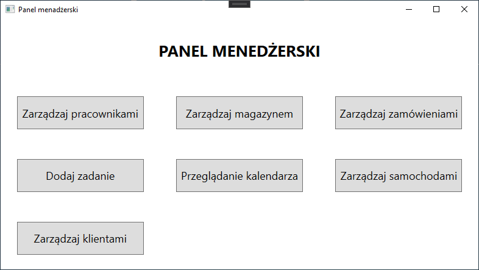
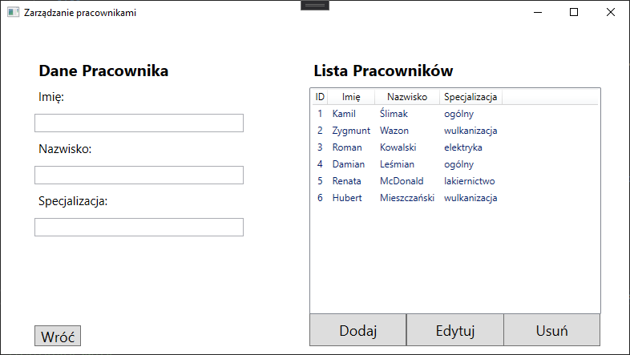
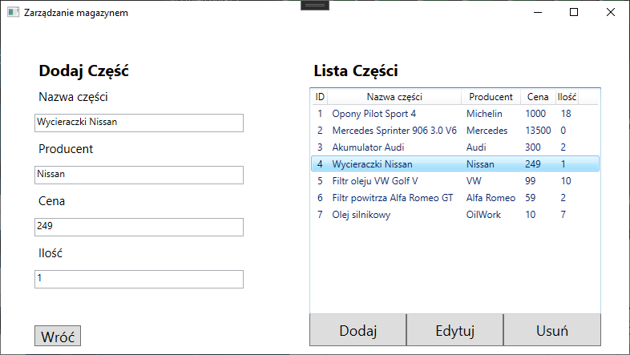
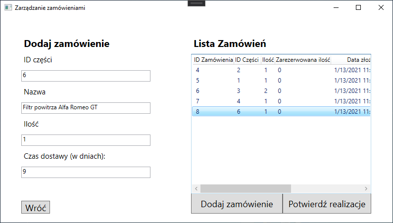
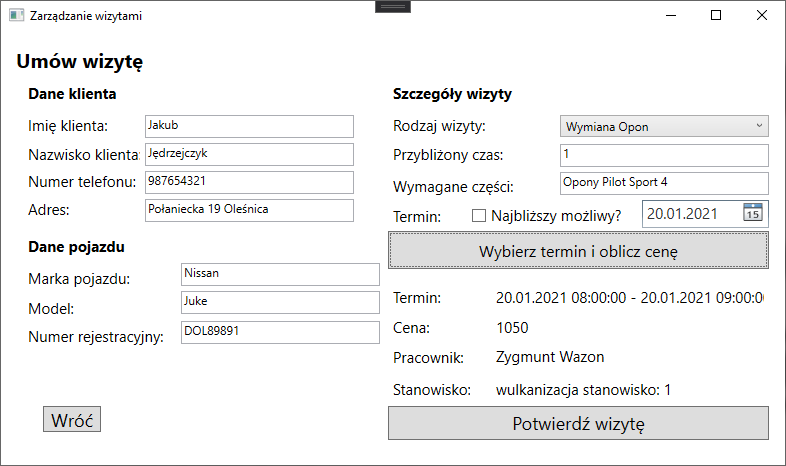
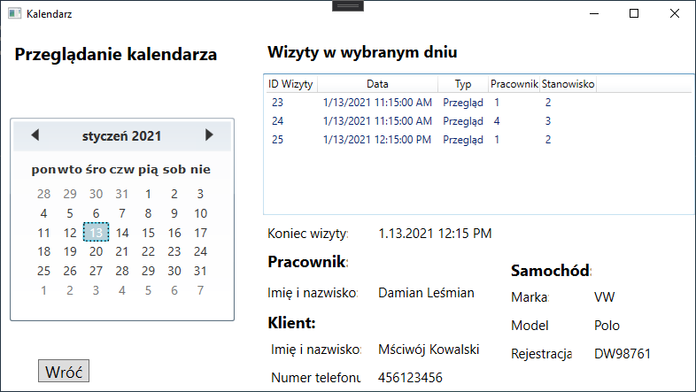
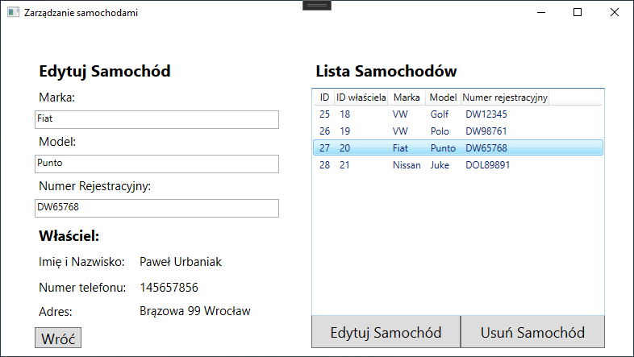
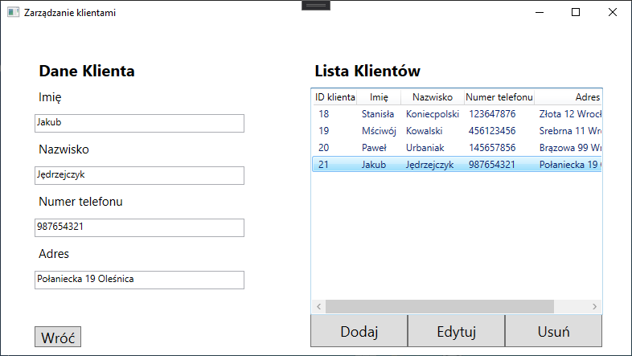

# Car Workshop - car workshop management application 

## Table of contents
* [General info](#general-info)
* [Project Assumptions](#assumptions)
* [Features](#features)
* [Technologies](#technologies)
* [Setup](#setup)

## General info

This application was made for "production, storage and transport control" classes. 

Application provides tools for car workshop menagement. It soter various data like: employees, customers, car parts e.t.c and allows
to add appointments and repairs in the calendar for a specific date or the closest possible one.

## Project Assumptions

1. desktop application
2. CRUD of employees, customers and parts
3. possibility of ordering parts and checking their availability
4. parts warehouse
5. employee groups (painters, electricians, mechanics, vulcanizers)
6. arranging customer visits
7. repair calendar management
8. price calculator for customers


## Features

The system includes management of:
* employees and workplaces
* car parts
* workshop work schedule

From main menu user can choose one of several activities



In the employee menu user can add, edit and browse employees.



Managing warehouse  allows to browse car parts and check if specific part is in the warehouse. Moreover, the user can add new parts, edit and delete them.



Orders management consists in ordering parts that are needed to make repairs.



Appointment management is the most important element of the project. In that window user can make an appointment by providing customer and car data, also user choses type of appointment, estimated repair time and needed parts. Then the method of appointment must be given by selecting the closest possible date or a specific one.

If closest possible date is chosen then implemented alghoritm finds closest date when there will be free employee, workplace and parts are in warehouse.



The calendar shows the appointments and their details.



In the car menu user can browse, edit and delete cars. Adding new car can only be done via making new appointment.

**Important note**: deleting car also delete its appointments.



The last window allows to browse, add, edit, and delete customers. 

**Important note**: deleting customer also delete his cars.



## Technologies
Project was created in the following technologies:
* C#
* WPF
* SQlite Database
* LINQ

And using the following tools:
* Visual Studio 2019
* SQLite Studio

## Setup
### Instalation
To run this project, clone this repository and import into Visual Studio
```
$ git clone git@github.com:Turandor/CarWorkshop.git
```
Then you have to install SQLite database from:

[SQLite website](https://www.sqlite.org/index.html)

**Project do not contain instalator!** 

**To run application you have to compile it in Visual Studio.**


